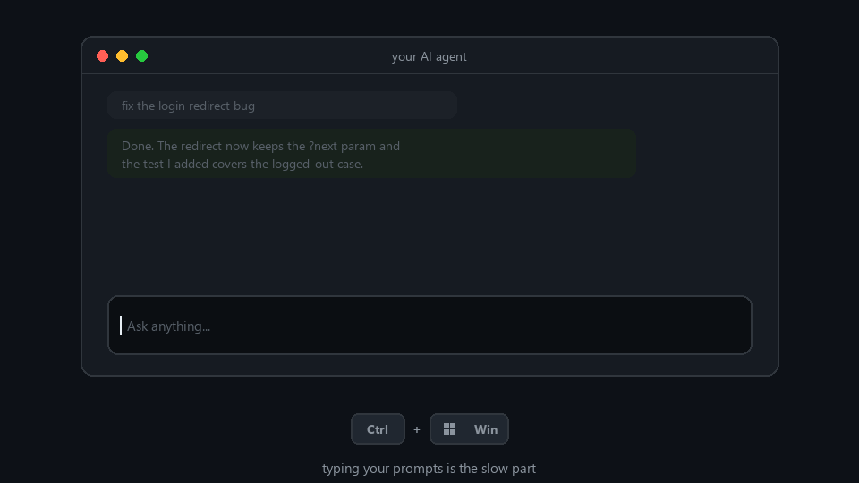

# Parakeet Dictation 🎙️

Talk to your AI instead of typing to it. For free, forever, no word limit.

If you vibe-code with Cursor, Claude Code, ChatGPT or anything like them, you already know the slow part is typing out the prompt. Talking is faster. The problem is every good voice tool wants a subscription. Wispr Flow is the one most devs use and it's genuinely great, but you pay for it and it counts your words.

This does the same job for nothing. Press Ctrl+Win, say whatever you want for as long as you want, press it again, and the text lands wherever your cursor is: your agent's chat box, a commit message, an email, anywhere. It transcribes in the background *while you're still talking*, so even a minute-long ramble pastes in about two or three seconds after you stop. ⚡

No word count. No monthly fee. No account. No limits, ever.

It runs a real speech model on your own machine (NVIDIA's Parakeet), so the quality is actually good, not the junk you get from the free built-in dictation. It handles 25 languages, figures out which one you're speaking on its own, and punctuates for you. It also runs fully offline, if that's your thing, but the point is that it's free and unlimited.

## Why this exists

I was paying for Wispr Flow just to talk to my coding agents all day. Then a friend pointed out you can run the speech model yourself with a small script and skip the subscription entirely. So I did. Now I talk to Claude and Cursor for free and never once think about a word limit. Figured other people stuck paying the same tax might want it too.

## Get it running (no Python needed)

The easy way. No Python, no setup, nothing to install.

1. Grab `ParakeetDictation-win64.zip` from the [Releases page](https://github.com/tristanmuzzu/parakeet-dictation/releases).
2. Extract it anywhere you like.
3. Double-click `ParakeetDictation.exe`.

The first launch pulls down the speech model (about 460 MB, once) and shows a small "Downloading speech model" pill while it does. When that clears, you're good. After that it starts in a second or two.

You need Windows 10 or 11 and a mic. That's it.

**One heads-up about Windows SmartScreen.** The exe isn't code-signed (signing costs money I'd rather not spend on a free tool), so Windows may pop up a blue "Windows protected your PC" box. Click "More info", then "Run anyway". And look, if running an unsigned exe from a stranger on the internet makes you uneasy, that's completely fair. Use the from-source route below instead: you can read every line first, and it's the exact same app.

## From source (you have Python)

You need Windows 10 or 11, Python 3.10 to 3.12 ([grab it here](https://www.python.org/downloads/), tick "Add to PATH" during install), and a mic.

**The lazy way (let your AI set it up):** hand this repo to Claude Code, Codex, Cursor, whatever you've got, and say:

> Clone https://github.com/tristanmuzzu/parakeet-dictation and set it up for me, follow the AGENTS.md.

[`AGENTS.md`](AGENTS.md) is a runbook written for AI agents. It has every command, how to check it worked, and the handful of things that can go wrong with the fixes.

**By hand (three steps, about five minutes):**

1. Download this repo (green "Code" button, then Download ZIP, then extract) or `git clone` it.
2. Right-click `setup.ps1` and pick "Run with PowerShell". It builds a private Python environment and installs what it needs.
3. Double-click `Start Dictation (debug).bat`. The first launch pulls down the speech model (about 460 MB, once). When the little amber dot in the bottom-right corner goes away, you're good.

After that first run, just use `Start Dictation.bat` (it runs quietly in the background), or set up auto-start below and forget it exists.

Both routes share the same model cache and only ever let one copy run at a time, so you can switch between the exe and the source install whenever you want without anything clashing.

## Using it

| Keys | What happens |
|---|---|
| **Ctrl + Win** | Starts listening. A small "Transcribing" pill shows up at the bottom of the screen. |
| **Ctrl + Win** again | Stops, and types what you said into whatever window you're in. |
| **Esc** | Throws away the current recording, types nothing. |
| **Ctrl + Alt + Q** | Quits. |

Talk in whatever language you like, even switching mid-sentence. It cleans up the obvious filler ("um", "uh", repeated words, stray spacing) on its own. That's plain text tidying, it does not reword what you said or run it through another AI.

Two small safety nets, because losing a long dictation hurts: the transcription stays in your clipboard after it's typed, so if you clicked into the wrong window you can just Ctrl+V it where it belonged. And every transcription is also appended to `transcripts.log` next to the app (plain text, stays on your machine, never uploaded), so nothing you say is ever truly lost.

## Make it start on its own

Right-click `install-autostart.ps1`, "Run with PowerShell", say yes to the one admin prompt. Now it's ready about half a minute after you log in, every time, without you doing anything. Changed your mind? `uninstall-autostart.ps1` removes it.

## When something's off

- **Ctrl+Win does nothing.** Your keyboard probably reports its keys under different names (German layouts call Ctrl "strg", for example). English and German are already handled. Run `tools/keytest.py`, press your keys, see what names show up, and add them to `norm()` in `dictation.py`. Or just open an issue with your keytest output and your keyboard's language and I'll add it.
- **Stuck on "Model still loading".** Give it a bit. The little amber dot in the corner disappears when it's ready (about 15 to 30 seconds normally).
- **Mic error.** Check Windows Settings, Privacy, Microphone, and that you actually have an input device set.
- **Nothing gets typed.** The window you're aiming at has to accept a normal Ctrl+V paste. Almost everything does.
- **Want a different hotkey?** Edit the key logic in `dictation.py` (it's commented), or ask your AI to swap it for you.

## The nerdy bit

Two processes. A tiny one holds the keyboard shortcut, the little pill, and the mic. A second one loads the model and does the actual recognition. They're split on purpose: Windows quietly kills a keyboard hook if the process holding it hogs the CPU, and loading a 600 MB model does exactly that, so the model is kept well away from the part that listens for your shortcut. Recognition uses [onnx-asr](https://github.com/istupakov/onnx-asr) with int8 weights on the CPU. Your text goes in with a clipboard paste, and it stays in the clipboard afterward on purpose, so you can paste it again anywhere.

Everything happens on your machine. Your audio never goes anywhere. The only time it touches the internet is that one model download on the first run.

## Free, and yours

The code is [MIT](LICENSE), do what you want with it.

The speech model, [nvidia/parakeet-tdt-0.6b-v3](https://huggingface.co/nvidia/parakeet-tdt-0.6b-v3), is NVIDIA's, under [CC-BY-4.0](https://creativecommons.org/licenses/by/4.0/). It isn't shipped in this repo, it downloads from Hugging Face on first run (the ONNX build is [istupakov/parakeet-tdt-0.6b-v3-onnx](https://huggingface.co/istupakov/parakeet-tdt-0.6b-v3-onnx)) under its own license.

Built on [onnx-asr](https://github.com/istupakov/onnx-asr), [sounddevice](https://github.com/spatialaudio/python-sounddevice), [keyboard](https://github.com/boppreh/keyboard), [pyperclip](https://github.com/asweigart/pyperclip), and NumPy. Thanks to Jonah for the nudge that started it.
